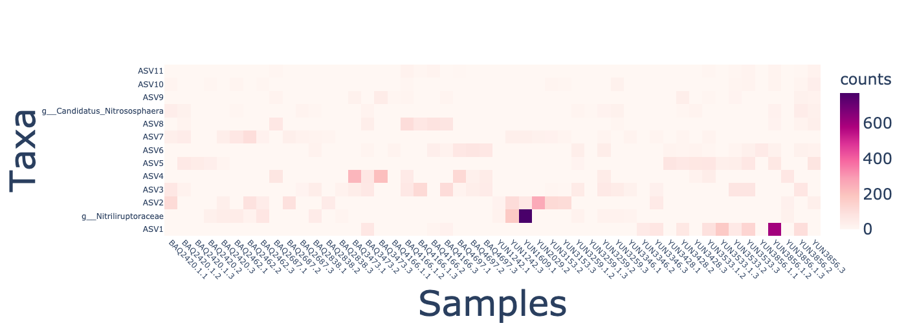
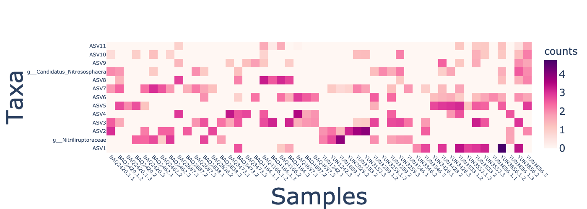

# Transforming data

```{usage-scope}
---
name: tutorial
---
```

```{usage-selector}
---
default-interface: galaxy-usage
---
```

Here we prepare the data for the downstream analysis


````{margin}
```{admonition} Note, compositional data

Explain here different types of transformations exist
```
````

## Transforming the data using mclr

[//]: # (```{usage})

[//]: # ()
[//]: # (def table_factory&#40;&#41;:)

[//]: # (    import qiime2)

[//]: # (    )
[//]: # (    table = qiime2.Artifact.load&#40;'atacama_table_composition', 'data/atacama-table_composition.qza'&#41;)

[//]: # (    return table)

[//]: # ()
[//]: # (table = use.init_artifact&#40;'table', table_factory&#41;)

[//]: # ()
[//]: # (transformed_table = use.action&#40;)

[//]: # (    use.UsageAction&#40;plugin_id='gglasso', action_id='transform_features'&#41;,)

[//]: # (    use.UsageInputs&#40;table=table,)

[//]: # (                    transformation='clr'&#41;,)

[//]: # (    use.UsageOutputNames&#40;transformed_table='atacama-table_clr'&#41;)

[//]: # (&#41;)

[//]: # ()
[//]: # (```)

:::{figure-md} markdown-fig


Atacama soil microbiome.
:::


:::{figure-md} markdown-fig


mclr-transformed Atacama soil microbiome.
:::


